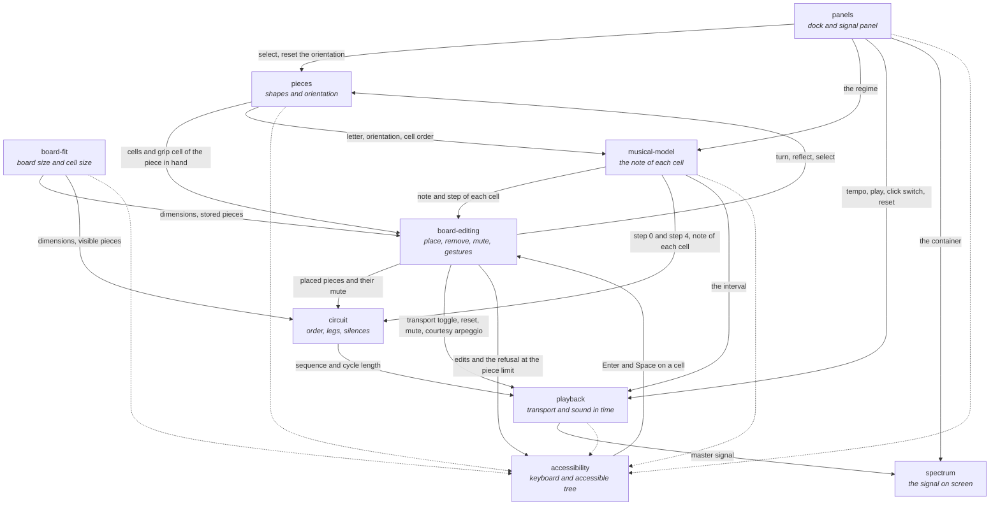

# Capabilities and what passes between them

The contract of each capability lives in its spec, `specs/<capability>/<capability>.md`. This
document does not repeat a contract. It declares what passes between the capabilities, because no
single spec can say it.

The rules to edit a spec are in [the spec rules](../../.agents/rules/specs.md).

## A capability is a folder, and its layers are inside

A capability is a slice of what the instrument does. Its code lives in `src/<capability>/`, the
folder with the name of its contract, and the layers are subfolders of it: `domain/`, `audio/`,
`ui/`. The spec gate checks the link both ways, and a generated `AGENTS.md` in the folder points
at the contract.

The folder is the only link. A spec names no file and no symbol, because files move inside a
capability and the contract stays.

## The map

A dotted line is not a request. Accessibility reads the state of the other capability and exposes
it in the accessible tree: the orientation of each piece, the note and the step of each cell, the
board size, the transport state and the tempo, and the controls of each panel.

## Where a new rule goes

| Capability | Decides | Does not decide |
|---|---|---|
| `pieces` | the twelve shapes, the eight orientations, the orientation each piece remembers | which gesture turns a piece |
| `board-editing` | what a click, a key or the wheel does to the board and to the piece in hand; the ghost; the piece limit | the focus inside the board, the wording of an announcement |
| `board-fit` | the dimensions, the cell size, which placed pieces are stored | the piece limit |
| `musical-model` | the tonic, the regime, the arpeggio, the degree and the step of each cell, the interval | when a piece sounds in the cycle |
| `circuit` | the order of the pieces, the legs and their moves, which leg event is a click or a crossing | what a muted piece sounds, when a new sequence starts |
| `playback` | the transport, the tempo, the voices, the mute effect, the swap at the cycle boundary, the playhead | the order of the events |
| `spectrum` | the analysis and the drawing of the signal | where the signal panel sits |
| `panels` | the floating panels, the layout and the look of the dock controls, the tooltips, the app identity | the accessible name of a control |
| `accessibility` | the accessible tree, the keyboard focus in the board, the announcements | the global shortcuts |

A rule that two capabilities decide is split wrong. One of the two consumes it, and its spec keeps
at most a line in "Dependencies".

## Terms that cross a boundary

One capability owns each term. The other specs use it with the same meaning.

| Term | Owner |
|---|---|
| grip cell, piece in hand, remembered orientation | `pieces` |
| ghost, pointed cell, piece limit, muted piece | `board-editing` |
| stored piece, visible piece, cell size | `board-fit` |
| regime, step, interval | `musical-model` |
| sequence, leg, move, route, click, crossing | `circuit` |
| sounding sequence, queued sequence, click switch, play button | `playback` |
| dock, slot, thumbnail, tempo clock | `panels` |

## The boundaries most likely to be confused

- **`circuit` and `playback`.** The circuit decides which events exist and on which interval.
  Playback decides when an interval is in seconds, which voice sounds, and when a new sequence
  starts. Test: does the rule still hold without a clock and without audio? Then it is the
  circuit's. A muted piece does not change the circuit, so the mute effect is playback's.
- **`board-editing` and `accessibility`.** Board editing owns every global shortcut: the letters,
  `Shift`, `Ctrl`, the wheel and the space bar, also when a cell or a control has focus.
  Accessibility owns the focus inside the board, Enter and Space as a click, and the announcements.
  Test: does a sighted mouse user need the rule? Then it is board editing's.
- **`panels` and `accessibility`.** Panels decides what a control shows and where it sits,
  tooltip included. Accessibility decides its name, its role and its pressed or open state. Test:
  does the eye read it, or the screen reader?
- **`pieces`, `board-editing` and `panels`.** Pieces decides what a turn, a reflection or a reset
  does to an orientation. Board editing and panels decide which input sends the command. Test: does
  the rule change an orientation, or only the way to ask for it?
- **`board-fit` and `board-editing`.** Board fit decides which placed pieces are stored. Board
  editing decides what an edit does on a cell of a stored piece, and counts stored pieces toward
  the piece limit. Test: does the rule need a resize to happen?
