<!-- Generated by `node .agents/scripts/sync.ts` from the imports of `src/`. Edit the source. -->

# Modules

An arrow goes from a file to what it imports. The test files are not in the map. `shell` is
the files at the root of `src/`. What passes between two capabilities, and why, is in
[the capability map](./capabilities.md).

## Capabilities

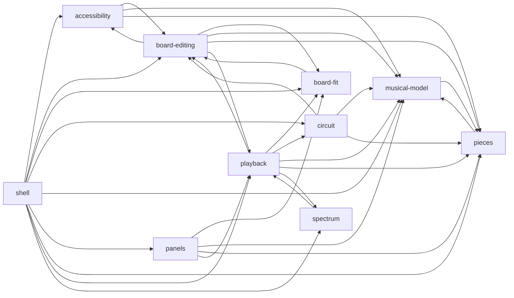

In each map below, a yellow box is a component and a slanted box is another capability.

## accessibility

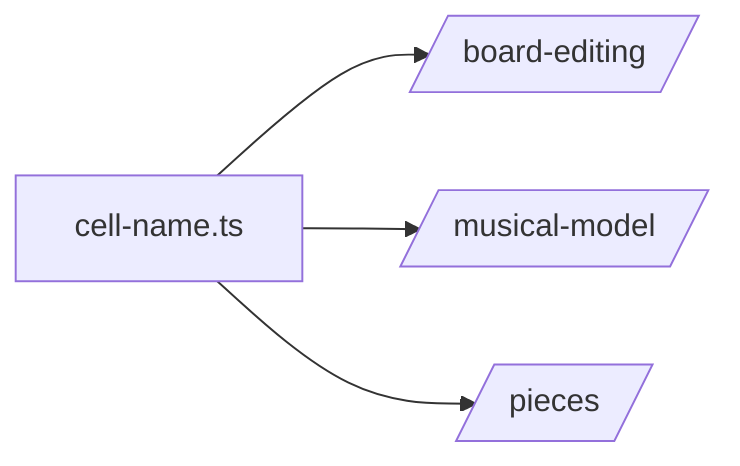

## board-editing

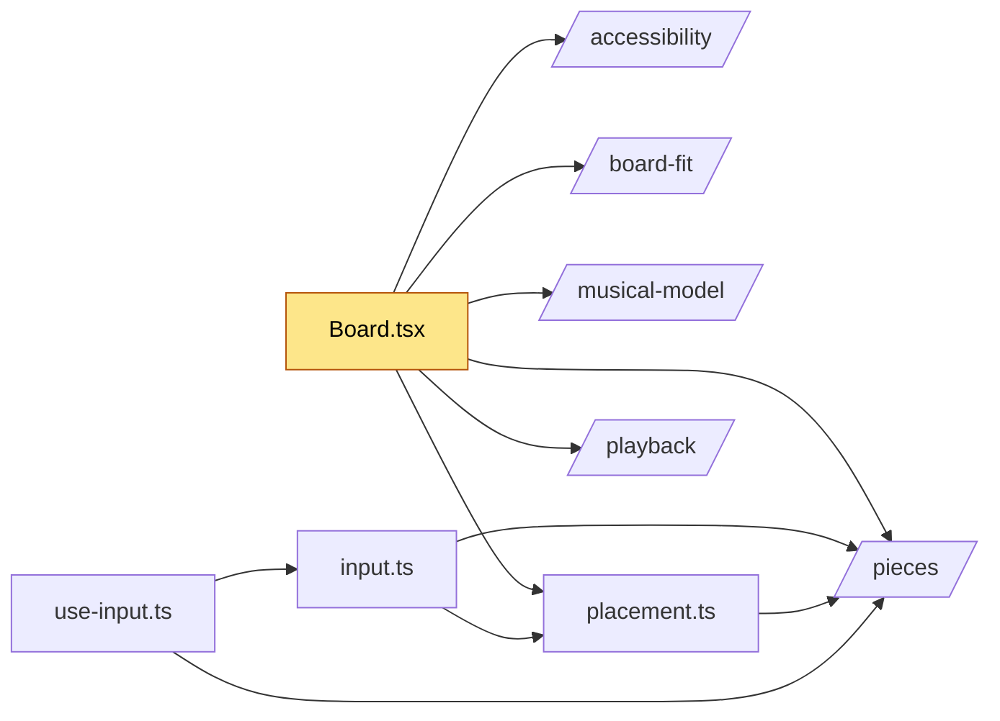

## board-fit

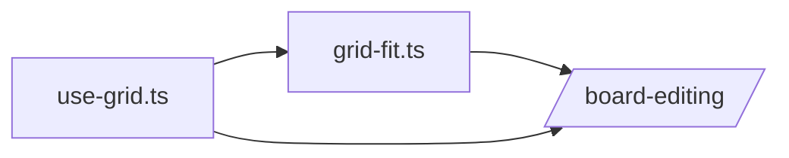

## circuit

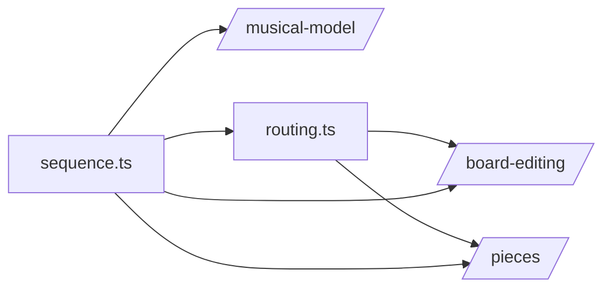

## musical-model

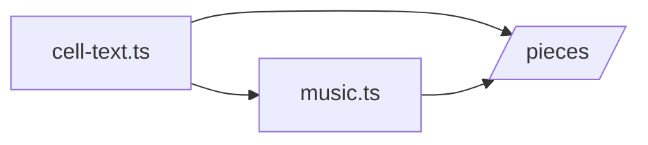

## panels

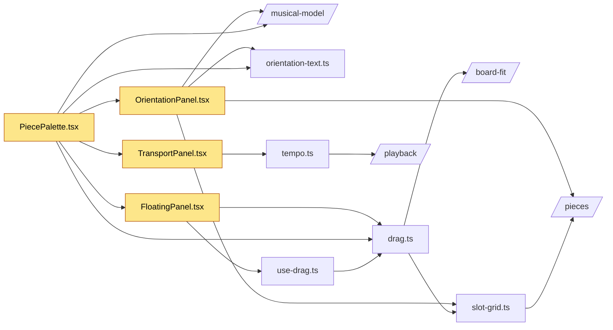

## pieces

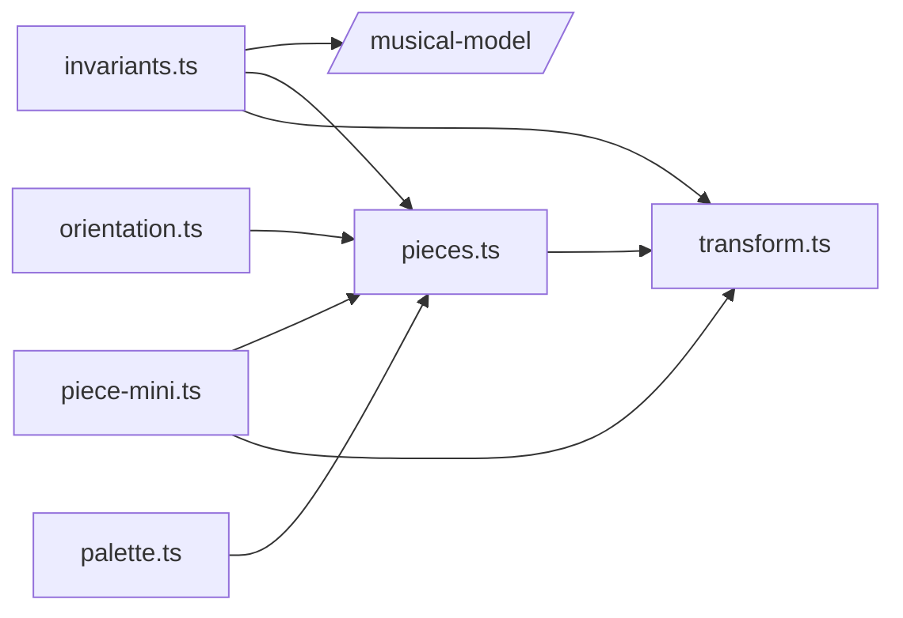

## playback

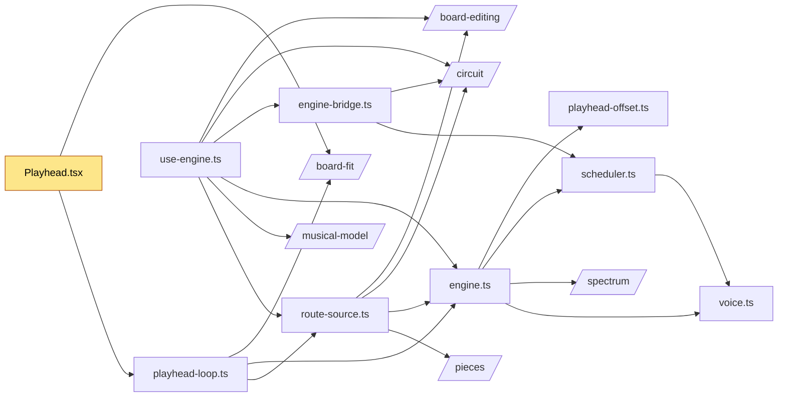

## shell

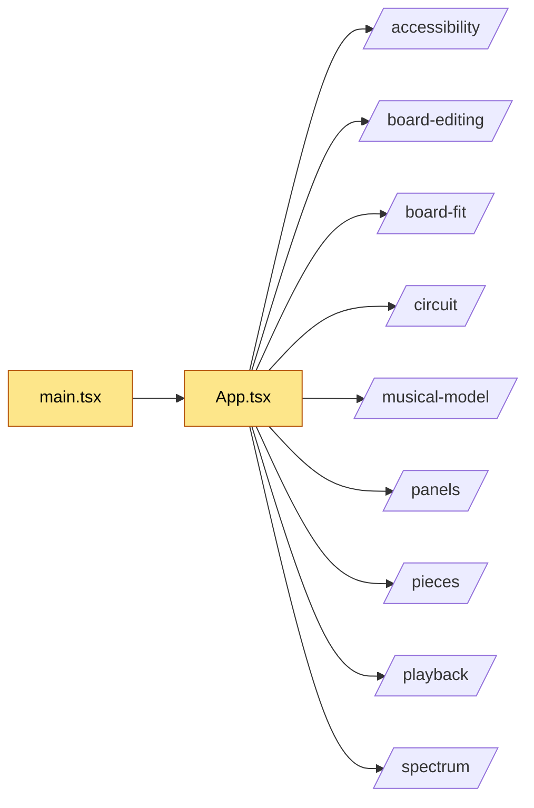

## spectrum

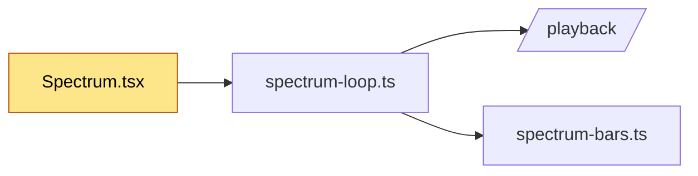
